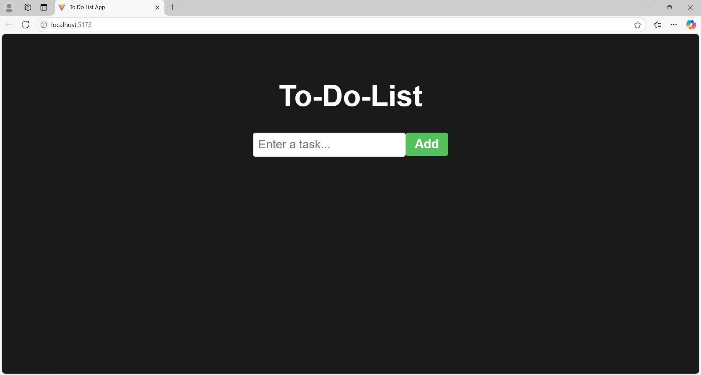
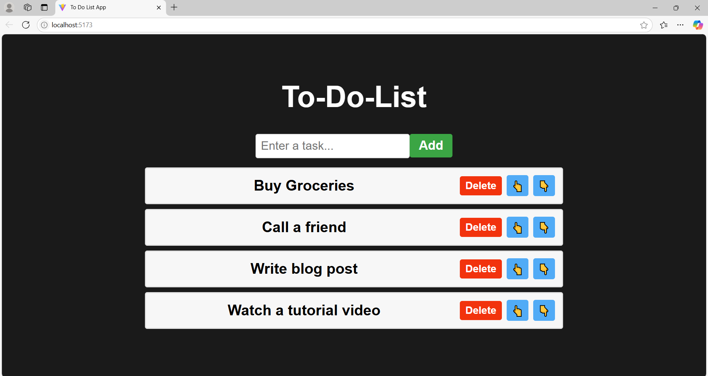
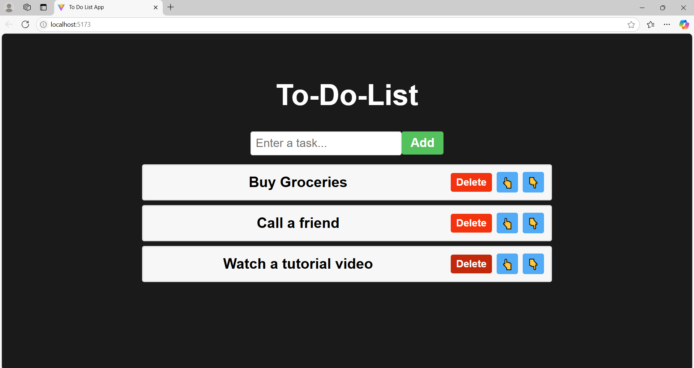

# To-Do List App

A dynamic and user-friendly To-Do List application built using **React** for managing daily tasks efficiently.

## Screenshots

## Features

- **Add tasks**: Users can add tasks to the list, which are managed using React's `useState` hook.
- **Delete tasks**: Completed tasks can be deleted to keep the list clean and organized.
- **Rearrange tasks**: Users can move tasks up or down within the list for better organization and flexibility.

## Tech Stack

- **Frontend**: React.js
- **State Management**: React's `useState` hook